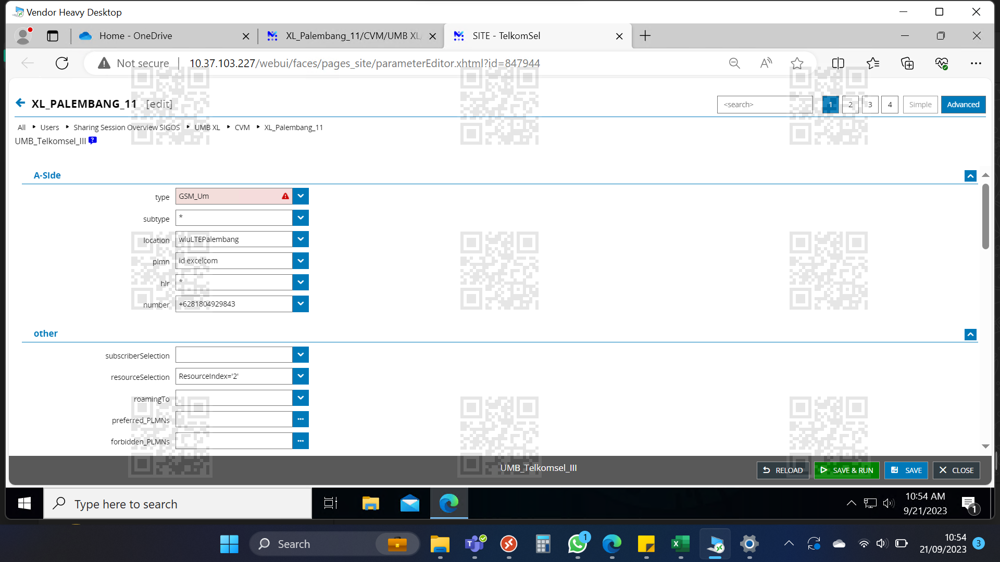

# Portofolio Proyek: Crawling Data Harga Paket USSD/UMB Multi-Kota

## Tujuan
Mengembangkan sistem **Otomatisasi USSD Terdistribusi** untuk crawling data harga paket internet dari berbagai operator seluler ( XL, Indosat, Tri, Smartfren) secara multi-geografis.  
Sistem ini memungkinkan pengumpulan harga yang akurat sesuai lokasi pelanggan, mendukung analisis variasi tarif regional.

---

## Fase I – Penentuan Lingkup Strategis & KPI
**Fokus:** Apa yang diuji dan bagaimana menilai keberhasilan.  

- **Lingkup:** Data harga paket internet dari 5 operator di 6 kota besar (Jakarta, Bandung, Surabaya, Bali, Medan, Makassar).  
- **KPI Utama:**
  - Latensi menu USSD < 5 detik.  
  - Tingkat keberhasilan navigasi end-to-end > 95%.  
  - Integritas data harga (tidak ada teks terpotong/salah parsing).  

---

## Fase II – Konfigurasi Lingkungan & Desain Skenario Uji
**Fokus:** Siapkan probe, skenario, dan skrip crawling.  

- **Arsitektur:**
  - **Probe Terdistribusi:**
    SIM fisik ditempatkan di kota target, dijalankan dengan perangkat uji (contoh: Mobileum/SIGOS probe).  
  - **Pusat Kontrol:**
    SITE (Integrated Test Environment) untuk orkestrasi eksekusi.  

**Contoh Dasar Lingkup Uji**  
Sebagai bagian dari penentuan lingkup, berikut setup awal pada **SIGOS Vendor Heavy Desktop**.  
Konfigurasi ini mendefinisikan node lokasi (*Palembang*), operator (*XL/Excelcom*), serta nomor uji yang akan digunakan.  
Hal ini memastikan KPI nantinya bisa diukur sesuai target lingkup pengujian.  

  


- **Desain Skenario:**
  1. Dial kode akses (contoh: `*363#` untuk Axis).  
  2. Navigasi menu otomatis (misal pilih `1 → 2 → 3`).  
  3. Ekstraksi teks dari layar USSD (paket, kuota, harga).  

- **Teknis:**
  - Skrip dibuat via *scripting studio* 
  - Parsing hasil USSD → format JSON.  
  - Contoh hasil parsing:
    ```json
    {
      "paket": "Freedom Harian",
      "kuota": "1GB",
      "harga": "Rp23rb"
    }
    ```

---

## Fase III – Eksekusi Otomatis & Pemantauan Real-Time
**Fokus:** Jalankan crawling di semua kota secara simultan.  

- **Eksekusi Paralel:** Probe di setiap kota menjalankan skenario pada jam terjadwal (contoh: setiap hari pukul 03.00 WIB).  
- **Pengumpulan Data Terpusat:** Semua hasil ekstraksi dikirim ke pusat (SITE DB).  
- **Monitoring:**
  - Dashboard real-time (Grafana/Power BI).  
  - Alert otomatis jika probe gagal navigasi atau parsing.  

---

##  Fase IV – Analitik Tingkat Lanjut & Optimalisasi Berkelanjutan
**Fokus:** Mengubah data harga menjadi insight.  

**Visualisasi Rekapitulasi**


### Ringkasan Statistik
- Total Eksekusi: **8,139**
- PASS: **3,303 (41%)**
- FAIL: **3,431 (42%)**
- INCONC: **1,405 (17%)**

### Insight Kota
- ✅ **Kinerja Baik:** Ngurah Rai Bali (100%), Bandung (99%), Malang (99%).  
- ⚠️ **Perlu Investigasi:** Makassar (50%), Samarinda (35%).  
- 🚨 **Kritis:** Balikpapan (0%).  

---

## ✅ Hasil & Dampak
- Sistem crawling otomatis menghasilkan **database harga paket real-time** multi-kota.  
- Data harga digunakan untuk **analisis kompetitor** dan **penyesuaian strategi produk**.  

---

## 💡 Peran Saya
- Membuat skenario navigasi USSD & parsing hasil menu.  
- Membangun pipeline eksekusi otomatis & integrasi data ke dashboard.  
- Menyusun laporan analisis.  
